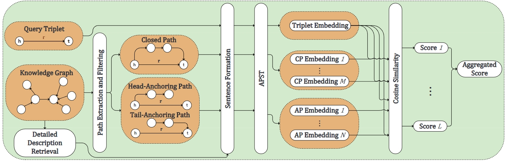

# Anchoring Path for Inductive Relation Prediction in Knowledge Graphs



Welcome to the repository for our paper accepted by AAAI 2024 titled **"Anchoring Path for Inductive Relation Prediction in Knowledge Graphs"**. Our paper introduces APST, a novel path-based method that leverages Sentence Transformer to enhance inductive relation prediction. APST is designed to retrieve detailed descriptions, capture supporting evidence through Anchoring Paths (APs), and integrate both Anchoring Paths and Closed Paths (CPs) for comprehensive predictions and insightful explanations.

## Requirements

Make sure you have the following dependencies installed:

- colorama 0.4.6
- matplotlib 3.7.2
- networkx 2.8.4
- numpy 1.23.5
- scikit_learn 1.2.1
- torch 1.12.1
- torch_geometric 2.2.0
- torch_sparse 0.6.16
- tqdm 4.64.1
- transformers 4.24.0

## Quick Start

To execute the comprehensive process of APST, we offer a convenient shell script `generate_train_and_test.sh`. This script requires the following parameters to be configured:

- `dataset`: Choose from available datasets such as `FB15k-237-subset`, `NELL-995-subset`, `WN18RR-subset`, `FB15k-237-subset-inductive`, `NELL-995-subset-inductive`, and `WN18RR-subset-inductive`.
- `suffix`: Specify the few-shot setting, options include `_full`, `_2000`, and `_1000`.
- `finding_mode`: Indicate whether to fix `head` or `tail`.
- `text_file` and `text_length`: Select the file containing detailed descriptions and set the maximum text length.
- `min_search_depth` and `max_search_depth`: Define the range for AP search depth.
- `rule_recall_threshold` and `rule_accuracy_threshold`: Set thresholds for AP accuracy and AP recall.

Run the following command to initiate the process:

```shell
./generate_train_and_test.sh
```
## Implementation Details

### Detailed Description Retrieval

We use a separate repository to retrieve the detailed descriptions, please refer to the repository [KGDescriptions](https://github.com/AAAI2024AnonymousSubmission13023/KGDescription).

### AP Extraction and Filtering

The entire process of AP extraction and filtering is implemented in the following three files:

- `path_finding_relation.py`: Generates CPs for relation prediction.
- `rule_finding.py`: Generates and filters APs from the training graph.
- `rule_generating.py`: Applies the filtered APs to generate specific APs on the training and testing graph.

### Sentence Formation, AP Encoding, and APST Prediction

The Sentence formation, AP encoding, and APST prediction process are implemented based on the sentence transformer model from [huggingface](https://huggingface.co/sentence-transformers/all-MiniLM-L6-v2). This model is used in the file `relation_prediction.py`. It also follows our previous state-of-the-art relation prediction model [KRST](https://github.com/ZhixiangSu/KRST).

## Citations

Currently not available.

## Q&A

For any questions, please leave an issue. We look forward to your further extensions and contributions.
